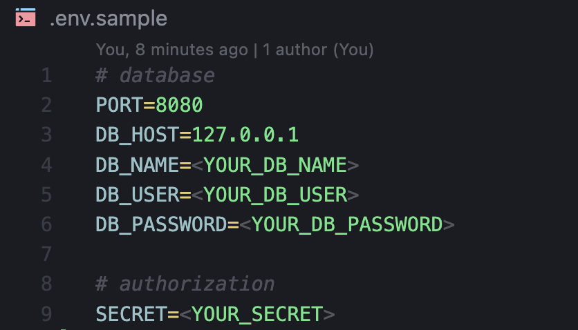
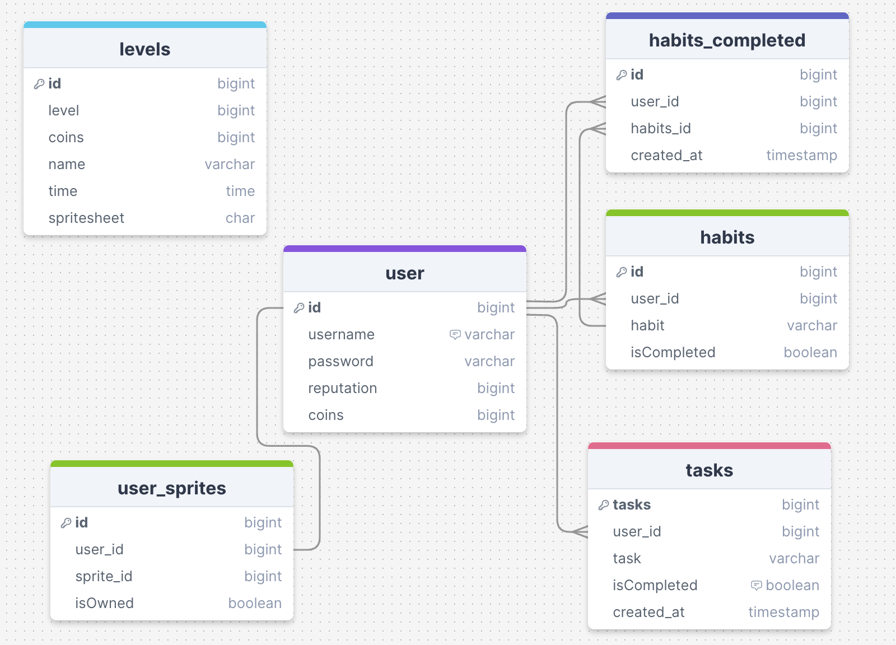

# Overview
This is the backend repo for Ha.BIT API server. This repo is to be ran with the front-end. For further and more complete documentation of the app: https://github.com/notaika/Ha.BIT. 

# Installation
IMPORTANT: This is the back-end only. For the frontend server, please navigate to: https://github.com/notaika/Ha.BIT

On your terminal, run:

1. `npm install`
    - (packages includes: axios, bcryptjs, cors, dotenv, express, jsonwebtoken, knex, mysql2, router)

2. Ensure that you setup your environment variables in a .env file: 

3. `npm start`

# Tech Stack
### Backend:
- Javascript
- Express
- Node.js
- MySQL + Knex.js
- JWT/bycryptjs for authentication

# Endpoints

## Users Routes
`/api/users`

### GET /
- **Description:** Retrieve a list of all users.
- **Controller:** `usersController.getUsers`

### POST /signup
- **Description:** Sign up a new user.
- **Controller:** `usersController.userSignup`

### POST /login
- **Description:** Log in a user.
- **Controller:** `usersController.userLogin`

### GET /profile
- **Description:** Retrieve the profile of the logged-in user.
- **Middleware:** `usersController.authorize`
- **Controller:** `usersController.getProfile`

### GET /:id
- **Description:** Retrieve details of a user by their ID.
- **Controller:** `usersController.getUser`

### PATCH /:id/coins/add
- **Description:** Add coins to a user by their ID.
- **Controller:** `usersController.addCoins`

### PATCH /:id/reputation
- **Description:** Add reputation to a user by their ID.
- **Controller:** `usersController.addReputation`

---

## Tasks Routes
`/api/tasks`

### GET /
- **Description:** Retrieve a list of all tasks for the logged-in user.
- **Middleware:** `userController.authorize`
- **Controller:** `tasksController.getTasks`

### POST /
- **Description:** Add a new task.
- **Controller:** `tasksController.addTask`

### GET /:id
- **Description:** Retrieve details of a task by its ID.
- **Controller:** `tasksController.getTask`

### DELETE /:id
- **Description:** Delete a task by its ID.
- **Controller:** `tasksController.deleteTask`

### PATCH /:id
- **Description:** Complete a task by its ID.
- **Middleware:** `userController.authorize`
- **Controller:** `tasksController.completeTask`

---

## Sprites Routes
`/api/sprites`

### GET /
- **Description:** Retrieve a list of all sprites.
- **Controller:** `spritesController.getSprites`

### GET /user
- **Description:** Retrieve sprites of the logged-in user.
- **Middleware:** `authorize`
- **Controller:** `spritesController.getUserSprites`

### POST /purchase
- **Description:** Purchase a sprite.
- **Middleware:** `authorize`
- **Controller:** `spritesController.purchaseSprite`

---

## Levels Routes
`/api/levels`

### GET /
- **Description:** Retrieve a list of all levels.
- **Controller:** `levelsController.getLevels`

# Data

---

For pixel.a endpoints, please navigate to pixel.a's API documentation: https://docs.pixe.la/
